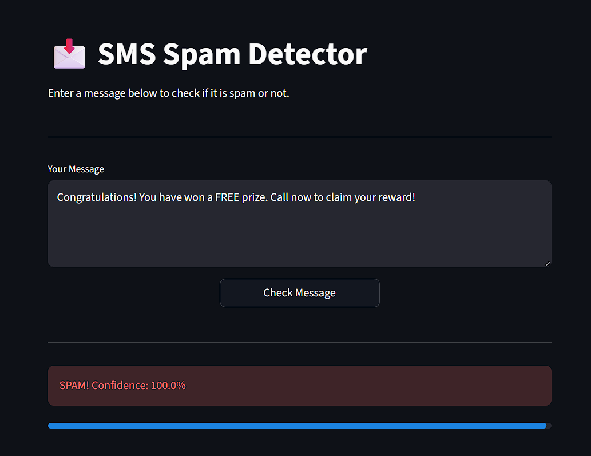
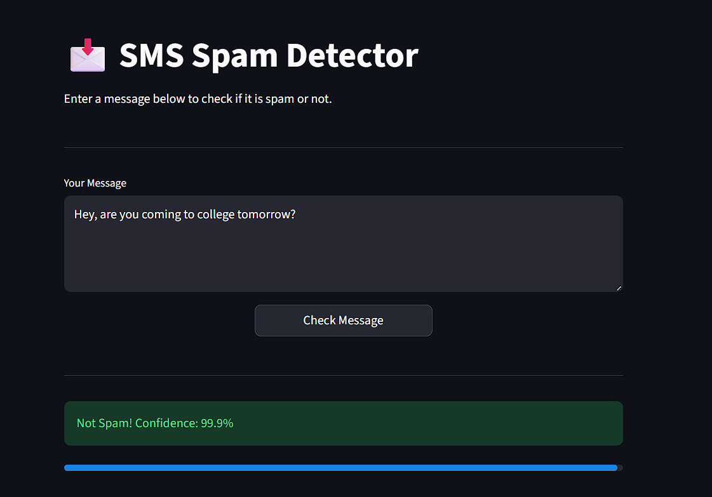

# SMS Spam Detector

A machine learning project that detects whether an SMS message is spam or not, built with Python, Scikit-learn, and Streamlit.

## Demo



## Problem Statement
SMS spam is a major issue — unwanted messages waste time and can be used for phishing or fraud. This project builds a classifier that automatically detects spam messages with high precision.

## Dataset
- **Source:** SMS Spam Collection Dataset (UCI ML Repository)
- **Size:** 5,169 messages after cleaning
- **Distribution:** 87% Ham, 13% Spam (imbalanced dataset)

## Approach
1. **EDA & Data Cleaning** (`01_eda.ipynb`) — Analyzed class distribution, message length patterns, word frequencies via wordclouds, removed 403 duplicate rows
2. **Text Preprocessing** (`02_preprocessing.ipynb`) — Lowercasing, punctuation removal, stopword removal, stemming using NLTK PorterStemmer, saved processed dataset
3. **Model Training & Evaluation** (`03_model_training.ipynb`) — TF-IDF vectorization, trained 4 models using Scikit-learn Pipelines, compared using Precision, Recall, F1 Score, saved best model
4. **Deployment** (`app.py`) — Streamlit web app with confidence scores

## Results

| Model | Accuracy | Precision | Recall | F1 Score |
|-------|----------|-----------|--------|----------|
| SVM | 97.29% | 100% | 78.63% | 88.03% |
| Random Forest | 96.99% | 98.08% | 77.86% | 86.81% |
| Naive Bayes | 96.52% | 98.97% | 73.28% | 84.21% |
| Logistic Regression | 96.13% | 100% | 69.47% | 81.98% |

**SVM chosen as final model** — perfect precision (no legitimate messages marked as spam) and best F1 score.

## Key Findings
- Spam messages are on average **2x longer** than ham messages
- Spam messages contain distinctive words like *"free", "win", "call", "prize"*
- TF-IDF outperforms Bag of Words by weighting rare but meaningful words higher
- Precision was prioritized over recall — better to miss some spam than block legitimate messages

## Project Structure
```
sms-spam-detector/
├── data/
│   ├── spam.csv                  ← raw dataset
│   ├── spam_clean.csv            ← after EDA cleaning
│   ├── spam_processed.csv        ← after text preprocessing
│   ├── class_dist.png            ← class distribution plot
│   ├── ham_wordcloud.png         ← ham wordcloud
│   ├── spam_wordcloud.png        ← spam wordcloud
│   ├── model_comparison.png      ← model comparison chart
│   └── confusion_matrix.png      ← SVM confusion matrix
├── notebooks/
│   ├── 01_eda.ipynb              ← exploratory data analysis
│   ├── 02_preprocessing.ipynb   ← text preprocessing
│   └── 03_model_training.ipynb  ← model training and evaluation
├── app.py                        ← Streamlit web app
├── model.pkl                     ← trained SVM pipeline
├── requirements.txt              
├── .gitignore                    
└── README.md                     
```

## How to Run
```bash
# Clone the repo
git clone https://github.com/Thusyya-Vardhan/SMS-Spam-Detector.git

# Create virtual environment
python -m venv venv
venv\Scripts\activate

# Install dependencies
pip install -r requirements.txt

# Run the app
streamlit run app.py
```

## Future Improvements
- Experiment with Word2Vec or BERT embeddings for richer text representation
- Deploy on Hugging Face Spaces for public access
- Build a REST API using FastAPI
- Add email header analysis for better spam detection

## Tech Stack
Python, Scikit-learn, NLTK, Pandas, NumPy, Matplotlib, Seaborn, Streamlit